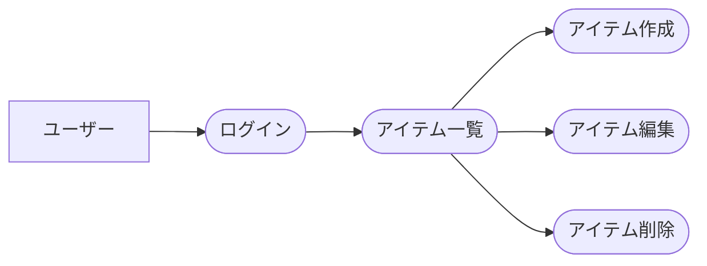
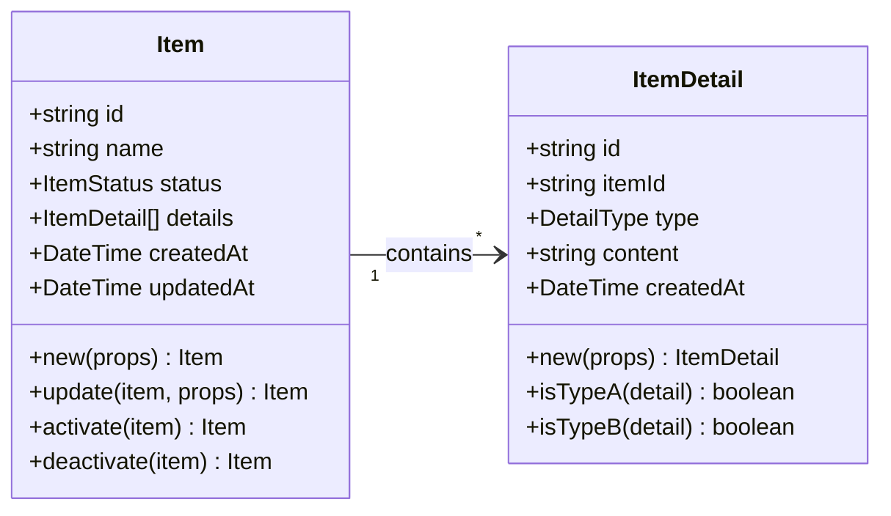
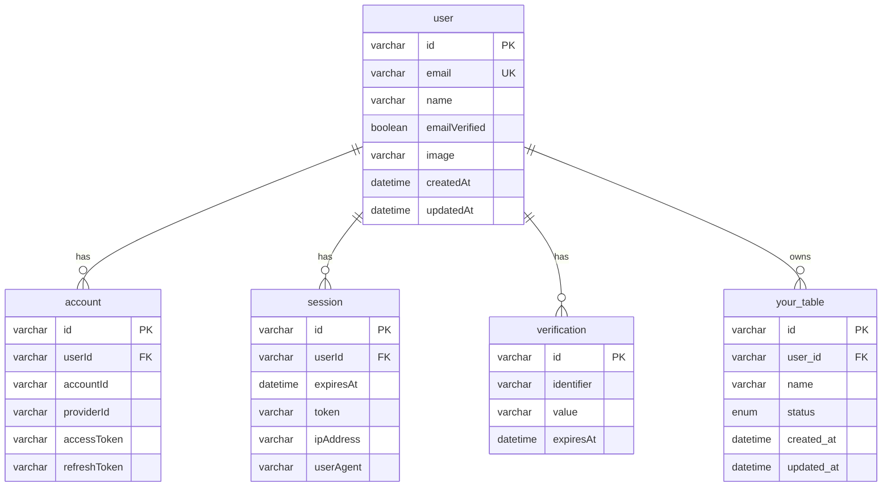

# Domain Model

## Overview

このドキュメントでは、ドメインモデリングの設計方針と構造を定義します。アプリケーション固有のドメインモデルは、この方針に従って実装してください。

## ファイル構成

ドメインモデルは集約ごとにディレクトリを分割し、各集約のルートエンティティと値オブジェクトを明確に分離しています。

```
services/api/domain/
└── [your-domain]/           # アプリケーション固有の集約
    ├── [aggregate-root].ts  # 集約ルート
    ├── [value-object].ts    # 値オブジェクト
    ├── [entity].ts          # 子エンティティ
    └── index.ts             # バレルファイル
```

## ドメインモデルの設計方針

### 1. Zod Schema First

すべての型定義はZodスキーマから導出します：

```typescript
// item.ts
export const itemSchema = z.object({
  id: z.string(),
  name: z.string(),
  status: z.enum(["active", "inactive"]),
  createdAt: z.date(),
});
export type Item = z.infer<typeof itemSchema>;
```

### 2. ドメインメソッドはコンパニオンオブジェクトパターン

各ドメインモデルは、同名のコンパニオンオブジェクトにファクトリメソッドやビジネスロジックを持ちます。
公開関数には JSDoc で事前条件・事後条件を記述します。詳細は [関数ドキュメント規約](./function-documentation.md) を参照。

```typescript
// item.ts
export const Item = {
  new: (props: CreateItemProps): Item => { ... },
  update: (item: Item, props: UpdateProps): Item => { ... },
  activate: (item: Item): Item => { ... },
  deactivate: (item: Item): Item => { ... },
} as const;
```

### 3. 型ガードとユーティリティ

Discriminated Unionを使用する場合は、型ガード関数も提供します：

```typescript
// item-detail.ts (Discriminated Union example)
export const ItemDetail = {
  isTypeA: (detail: ItemDetail): detail is TypeADetail =>
    detail.type === "type_a",
  isTypeB: (detail: ItemDetail): detail is TypeBDetail =>
    detail.type === "type_b",
  default: (): DefaultDetail => ({ type: "default" }),
} as const;
```

### 4. イミュータブルな更新

すべての更新操作は新しいオブジェクトを返します：

```typescript
const updatedItem = Item.update(item, { name: "新しい名前" });
const activatedItem = Item.activate(item);
```

## リポジトリの設計方針

### 1. drizzle-zodスキーマをDTOとして活用

リポジトリ層ではDrizzleが生成する`select*Schema`をDTOとして活用し、手動でのマッピングを最小化します：

```typescript
import {
  type SelectItem,
  type SelectItemDetail,
  itemsTable,
  selectItemDetailsSchema,  // drizzle-zod schema
  itemDetailsTable,
} from "./mysql/schema";

// Helper to convert DB item + details to domain aggregate
const toItemAggregate = (
  item: SelectItem,
  details: SelectItemDetail[],
): Item => ({
  id: item.id,
  name: item.name,
  // ... 直接マッピング
  // Use drizzle-zod schema as DTO for child entities
  details: details.map((row) => selectItemDetailsSchema.parse(row)),
});

// For simple entities, use schema directly
return Ok(selectItemsSchema.parse(result.val[0]));
```

### 2. シンプルなマッピング

DBの行をドメインモデルに変換するヘルパー関数はシンプルに保ちます：

```typescript
// Good: シンプルなマッピング
const toItemAggregate = (
  item: SelectItem,
  details: SelectItemDetail[],
): Item => ({
  id: item.id,
  name: item.name,
  // ... 直接マッピング
  details: details.map(toItemDetail),
});

// Bad: 冗長な展開
const items = itemsResult.val.map((item) => ({
  id: item.id,
  name: item.name,
  // ... 毎回同じフィールドを列挙
}));
```

### 3. N+1問題の回避

集約の子エンティティを取得する際は、`inArray`を使用して一括取得します：

```typescript
// Good: 一括取得
const itemIds = items.map((i) => i.id);
const detailsResult = await tx
  .select()
  .from(itemDetailsTable)
  .where(inArray(itemDetailsTable.itemId, itemIds));

// Group by itemId
const detailsByItemId = new Map<string, SelectItemDetail[]>();
for (const detail of detailsResult) {
  const existing = detailsByItemId.get(detail.itemId) ?? [];
  existing.push(detail);
  detailsByItemId.set(detail.itemId, existing);
}

// Bad: N+1クエリ
for (const item of items) {
  const details = await tx
    .select()
    .from(itemDetailsTable)
    .where(eq(itemDetailsTable.itemId, item.id));
}
```

### 4. ドメインモデルとDBモデルの一致

過度な正規化を避け、ドメインモデルとDBモデルをできるだけ一致させます：

```typescript
// Good: DBと同じフラット構造
const itemMetricsSchema = z.object({
  id: z.string(),
  itemId: z.string(),
  metric1: z.number(),
  metric2: z.number(),
  metric3: z.number(),
  // ...
});

// Bad: 不必要な正規化（配列への変換）
const itemMetricsSchema = z.object({
  metrics: z.array(
    z.object({
      type: z.string(),
      value: z.number(),
    })
  ),
});
```

APIの後方互換性が必要な場合は、DTO層で変換を行います。

## 命名規則

### データベース
- テーブル名: 複数形 snake_case (`users`, `items`, `orders`)
- カラム名: snake_case (`user_id`, `created_at`, `item_id`)
- 外部キー: `{参照先テーブル単数形}_id` (`user_id`, `item_id`, `order_id`)

### アプリケーション
- ドメインモデル: PascalCase (`User`, `Item`, `Order`)
- 型定義: PascalCase (`ItemStatus`, `OrderType`)
- 型エイリアス（export用）: `{Model}Type` (`UserType`, `ItemType`)
- 変数/プロパティ: camelCase (`itemId`, `createdAt`)
- リポジトリ: `{Model}Repository` (`ItemRepository`)
- ユースケース: `{Model}UseCase` (`ItemUseCase`)

## データ保存の基本方針

- **ユーザー単位での保存**: すべてのデータはユーザー（User）に紐づいて保存されます
- **トランザクション管理**: 複数のリポジトリを跨ぐ処理はユースケース層でトランザクションを管理します
- **Result型によるエラーハンドリング**: すべてのエラーはResult型で統一的に扱います
- **集約単位での更新**: 各集約はリポジトリとユースケースで独立して管理し、集約単位で保存します

## 集約境界

各集約は独立したユースケースとリポジトリで管理します。

### [YourAggregate] (Example)
- **ルートエンティティ**: [AggregateRoot]
- **値オブジェクト**: [ValueObject1], [ValueObject2]
- **子エンティティ**: [ChildEntity]
- **ファイル**: `domain/[your-domain]/`
- **ユースケース**: `[YourAggregate]UseCase`
- **リポジトリ**: `[YourAggregate]Repository`
- **操作**: 作成、更新、取得、削除
- **主要メソッド**:
  - `[AggregateRoot].new()` - 作成
  - `[AggregateRoot].update()` - 更新
  - `[AggregateRoot].[businessMethod]()` - ビジネスロジック

## Use Case Diagram (Example)



## Class Diagram (Example)



## ER Diagram (Example)



## Enums (Examples)

### ItemStatus
- `active` - 有効
- `inactive` - 無効
- `archived` - アーカイブ済み

### DetailType
- `type_a` - タイプA
- `type_b` - タイプB
- `default` - デフォルト

## API Endpoints (Examples)

### Item API
- `GET /items` - アイテム一覧取得
  - Response: `{ items: [{ id, name, status, createdAt, ... }] }`
- `POST /items` - アイテム作成
  - Request: `{ name, status? }`
  - Response: `{ id, name, status, createdAt, updatedAt }`
- `GET /items/{itemId}` - アイテム取得
  - Response: `{ id, name, status, details, createdAt, updatedAt }`
- `PUT /items/{itemId}` - アイテム更新
  - Request: `{ name?, status? }`
- `DELETE /items/{itemId}` - アイテム削除
